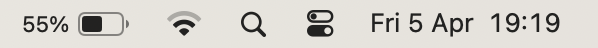

# Checklist: \<Object>


\<Short description of the checklist.>

## Contents

<!--
  To generate the table of contents (ToC) with Vim:
    1. Make sure https://github.com/mzlogin/vim-markdown-toc is installed
    2. Execute: :let g:vmt_list_item_char = '- [ ]'
    3. Remove '<DELETE>' from the below comment
    4. Save the file (table of contents is automatically regenerated on save)
    5. Re-add '<DELETE>' to prevent accidential regeneration of ToC 
-->

<!-- <DELETE>vim-markdown-toc GFM -->

- [ ] [1. Normal item](#1-normal-item)
- [ ] [2. Repo reference item](#2-repo-reference-item)

<!-- vim-markdown-toc -->

## 1. Normal item

> **Note:** this is a note with a [_link to another section_](#2-repo-reference-item).

1. Go to _**Foo → Bar → Baz**_
1. Set _**Foo**_ to _**Bar**_
1. Change the following items to these values:
   | Item      | Value     |
   |:----------|:----------|
   | _**Foo**_ | _**Bar**_ |
   | _**Baz**_ | _**Kux**_ |
1. Execute the following:
   ```bash
   echo foo
   ```
1. See this image:<br />
   

[↑ Top](#contents)

## 2. Repo reference item


✅ See [**weibeld-setup/_\<repo-name>_**](https://github.com/weibeld-setup/)

[↑ Top](#contents)
